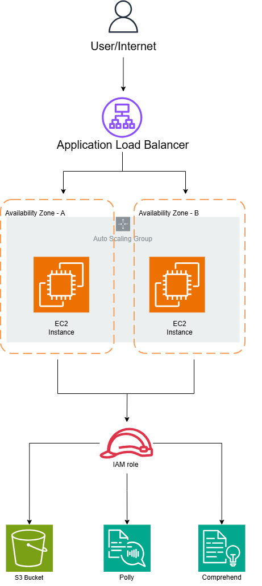

# Highly Available Text-to-Speech App on AWS

A .NET 9 ASP.NET Core web application deployed on AWS with a highly available architecture. The app converts text to speech in multiple languages using AWS Polly and detects language using AWS Comprehend, served through an Application Load Balancer across two Availability Zones.

---

## Architecture

<!-- Save your draw.io diagram as screenshots/architecture-diagram.png -->


```
Internet
    |
Application Load Balancer
(public subnets — AZ-a & AZ-b)
    |
Auto Scaling Group
|-- EC2 Instance (AZ-a) — .NET 9 App on port 5000
|-- EC2 Instance (AZ-b) — .NET 9 App on port 5000
    |
IAM Role (least-privilege)
|-- AWS Polly        — Text-to-Speech
|-- AWS Comprehend   — Language Detection
|-- S3               — App Artifact Storage
```

---

## AWS Services Used

| Service | Purpose |
|---|---|
| VPC | Custom network with public subnets across 2 AZs |
| EC2 | Application servers running the .NET 9 app |
| Application Load Balancer | Distributes traffic, single entry point |
| Auto Scaling Group | Self-healing, maintains desired capacity |
| S3 | Stores app zip for automated deployment |
| IAM | Role-based access, zero hardcoded credentials |
| AWS Polly | Neural text-to-speech in multiple languages |
| AWS Comprehend | NLP and language detection |

---

## Features

- **High Availability** — Deployed across 2 AZs, no single point of failure
- **Self-Healing** — ASG automatically replaces unhealthy instances based on ELB health checks
- **Auto Scaling** — Scales out when CPU exceeds 50%, scales in when load drops
- **Secure** — IAM role-based authentication, no hardcoded credentials, least-privilege access
- **Automated Deployment** — App pulled from S3 and started via EC2 User Data on every instance launch

---

## Infrastructure Screenshots

### Load Balancer — Active


### Target Group — Both Instances Healthy


### Auto Scaling Group — 2 Instances InService


### IAM Role — Least Privilege Policies


### S3 Bucket — App Artifact


### App Running on EC2 — systemctl status


---

## Clip Walkthroughs

### 1 — Self Healing in Action
Terminating an instance and watching ASG automatically detect the failure and launch a replacement without any manual intervention.

<!-- 
  Drag and drop self-healing.mp4 into this README while editing on GitHub.com
  GitHub will generate an embed link — paste it here replacing this comment
-->

https://github.com/Uttkarshtiwari55/texttospeech-aws/assets/REPLACE_WITH_YOUR_ASSET_ID/self-healing.mp4

---

### 2 — Architecture Walkthrough
Clicking through each AWS service — ALB, Target Group, Auto Scaling Group, IAM Role — showing how they connect together.

<!-- 
  Drag and drop architecture-walkthrough.mp4 into this README while editing on GitHub.com
  GitHub will generate an embed link — paste it here replacing this comment
-->

https://github.com/Uttkarshtiwari55/texttospeech-aws/assets/REPLACE_WITH_YOUR_ASSET_ID/architecture-walkthrough.mp4

---

### 3 — User Data Script Explained
Walkthrough of the EC2 User Data script that automatically installs the .NET 9 runtime, pulls the app from S3, and starts it as a systemd service on every instance launch.

<!-- 
  Drag and drop userdata-explained.mp4 into this README while editing on GitHub.com
  GitHub will generate an embed link — paste it here replacing this comment
-->

https://github.com/Uttkarshtiwari55/texttospeech-aws/assets/REPLACE_WITH_YOUR_ASSET_ID/userdata-explained.mp4

---

## Deployment

See the full step-by-step guide: [deployment-guide.md](docs/deployment-guide.md)

### Quick Summary
1. Upload `app.zip` to S3
2. Create VPC with 2 public subnets across 2 AZs — enable auto-assign public IPv4
3. Create IAM role with Polly, Comprehend, S3 access
4. Create Security Groups for ALB and EC2
5. Create Launch Template with User Data script
6. Create Target Group on port 5000
7. Create Application Load Balancer on port 80
8. Create Auto Scaling Group — instances register to TG automatically

---

## Real Issues Encountered and Fixed

These are actual problems hit during deployment — not a tutorial follow-along.

| Problem | Root Cause | Fix |
|---|---|---|
| User Data script timing out | Public subnets had no auto-assign public IP | Enabled auto-assign public IPv4 on subnets |
| S3 download 404 error | File name had spaces | Renamed to `app.zip` |
| App failing with exit-code 150 | Wrong .NET package installed | Used `aspnetcore-runtime-9.0` not `dotnet-runtime-9.0` |
| Dotnet binary not found | Different path on Amazon Linux 2023 | Used `/usr/lib64/dotnet/dotnet` instead of `/usr/bin/dotnet` |
| Browser timeout on ALB URL | Browser auto-upgrading to HTTPS | Explicitly used `http://` in URL |
| EC2 Instance Connect failing | No public IP assigned to instance | Enabled auto-assign public IPv4 on subnet |

---

## Key Technical Decisions

**Why public subnets instead of private subnets with NAT Gateway?**
For this learning project, public subnets with restricted security groups were used to avoid NAT Gateway costs. In production, EC2 instances would sit in private subnets behind a NAT Gateway — that is the correct production architecture.

**Why User Data instead of Elastic Beanstalk?**
Elastic Beanstalk automates exactly what was built here manually — ALB, ASG, EC2, health checks, deployment. Building it from scratch demonstrates understanding of each component individually rather than treating Beanstalk as a black box.

**Why IAM Role instead of access keys?**
IAM roles follow AWS security best practices. Credentials are temporary, automatically rotated, and never stored on the instance — no risk of accidentally exposing keys in code or config files.

---

## Repository Structure

```
|-- README.md
|-- docs/
|   |-- deployment-guide.md
|-- userdata/
|   |-- userdata.sh
|-- screenshots/
|   |-- architecture-diagram.png
|   |-- alb-active.png
|   |-- target-group-healthy.png
|   |-- asg-instances.png
|   |-- iam-role.png
|   |-- s3-bucket.png
|   |-- systemctl-running.png
|-- videos/
    |-- self-healing.mp4
    |-- architecture-walkthrough.mp4
    |-- userdata-explained.mp4
```

---

## About

**Uttkarsh**
AWS Solutions Architect Associate (In Progress) · CSE Student · Cloud and Infrastructure Enthusiast

---

## License

This project is open source and available under the [MIT License](LICENSE).
